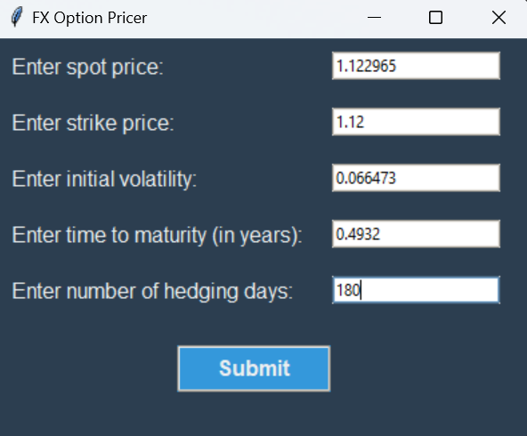
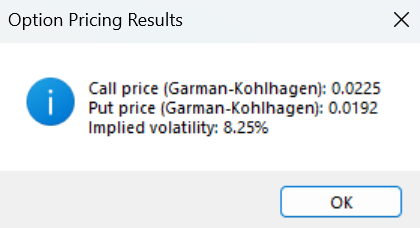
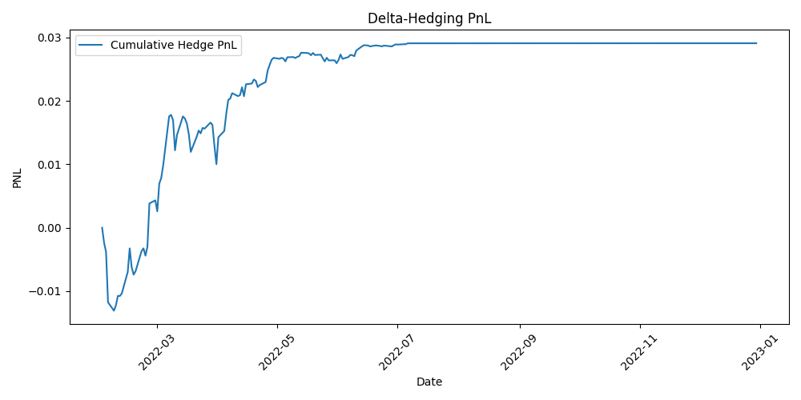

# FX Option Pricing & Delta Hedging Strategy  

## 📌 Overview  
This project implements an **FX option pricer** using the **Garman-Kohlhagen model**, incorporating **real market data**.  
It also includes an **implied volatility calculator** and a **delta hedging backtest**, allowing an in-depth analysis of risk management efficiency in FX options trading.  

---

## ⚙️ Features  
### 1️⃣ FX Option Pricing (Garman-Kohlhagen Model)  
- Computes **Call and Put prices** for FX options using market inputs (spot price, interest rates, and volatility).  
- Uses the **Garman-Kohlhagen formula**, which extends Black-Scholes for foreign exchange options:  

$$C = S e^{-qT} N(d_1) - K e^{-rT} N(d_2)$$  
$$P = K e^{-rT} N(-d_2) - S e^{-qT} N(-d_1)$$  

Where:  

$$d_1 = \frac{\ln(S/K) + (r - q + \sigma^2 / 2)T}{\sigma \sqrt{T}}$$  
$$d_2 = d_1 - \sigma \sqrt{T}$$  

### 2️⃣ Implied Volatility Calculation  
- Uses **numerical root-finding (Newton-Raphson method)** to estimate the implied volatility from market option prices.  
- Extracts **market expectations** on future price movements.  

### 3️⃣ Delta Hedging Strategy Backtest  
- Simulates a **delta hedging strategy** over a given time period.  
- Adjusts the hedge **daily** to remain delta-neutral.  
- Computes and visualizes **PnL evolution** throughout the hedging period.  

### 4️⃣ Real Market Data Integration  
- Fetches **FX spot rates** (EUR/USD) using Yahoo Finance.  
- Retrieves **interest rates** (EUR & USD) from FRED.  
- Calculates **historical volatility** from real price fluctuations.

---

## 📊 Methodology  
### **Step 1: Data Collection**  
The project collects the following market data:  
✅ **Spot FX Rate** (EUR/USD) from Yahoo Finance  
✅ **Risk-free interest rates** (EUR & USD) from FRED  
✅ **Volatility estimation** (using a 20-day rolling window)  

### **Step 2: FX Option Pricing (Garman-Kohlhagen Model)**  
- The model computes **Call and Put prices** using real interest rates and market volatility.  
- Pricing results depend on key parameters:  
  - **Spot price (S)**  
  - **Strike price (K)**  
  - **Time to maturity (T)**  
  - **Domestic interest rate (r)**  
  - **Foreign interest rate (q)**  
  - **Volatility (σ)**  

### **Step 3: Implied Volatility Calculation**  
- The script finds the volatility **σ** that matches the market price using a root-finding algorithm.  
- This allows for **extracting market expectations** regarding future volatility.  

### **Step 4: Delta Hedging Backtest**  
- We **simulate** a trader dynamically adjusting their hedge **each day**.  
- The trader buys/sells the underlying to maintain a **delta-neutral position**.  
- The **final PnL** measures the efficiency of the hedge.

---

## **🔍 Example Results**

Here are the results of the FX option pricing and delta hedging strategy for different maturities.  
📌 **Note:**  
- The **implied volatility and delta hedging PnL are computed only for the Call option**.  
- The **Put option is only priced** using the Garman-Kohlhagen model.

### **1️⃣ Input Parameters**
  

- **Spot Price:** `1.122965`
- **Strike Price:** `1.12`
- **Initial Volatility:** `0.066473`
- **Interest Rates:** Retrieved from dataset

### **2️⃣ Pricing & Implied Volatility**
  

This step computes:
- The **Call and Put option prices** using the **Garman-Kohlhagen model**.
- **Implied Volatility (for the Call only)**, found via numerical root-finding.

### **3️⃣ PnL of Delta Hedging Strategy (Call Option Only)**

  

- **Delta hedge is adjusted daily over 180 days.**
- **PnL fluctuations remain small, proving that the delta hedge is effective.**  
- **The hedging strategy adapts to market movements over time, reducing risk exposure.**  

---

## 📂 Data Source & Customization  

The dataset (`fx_data.csv`) provided is an **example dataset** containing historical FX market data of EUR/USD from 2022.  
However, users can generate their own dataset by running the data import script with custom parameters (FX pair, data period, interest rate sources):

```bash
  python data_import.py
```

---

## 🖥️ Installation & Setup

1️⃣ **Clone the repository**  
```bash
  git clone https://github.com/Sylvain-Topeza/FX_Option_Pricing.git
  cd FX-Option-Pricing
```

2️⃣ **Install dependencies**  

This project requires Python 3.8+ and the following libraries:
```bash
  pip install numpy pandas matplotlib scipy yfinance pandas_datareader tk
```

3️⃣ **Run the project**  
```bash
  python main.py
```


